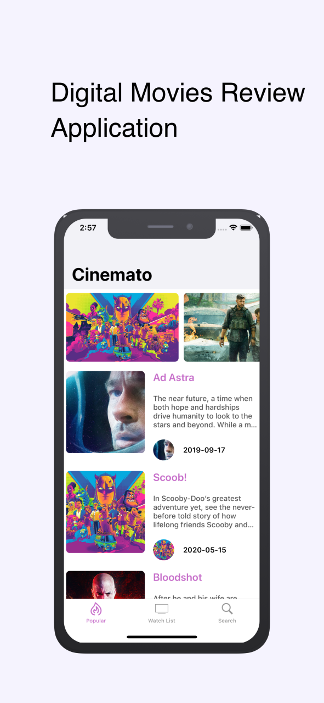

# Digital Movies Reviews Platform Application

The repository contains the IOS project developed using swift programming language for 301CEM coursework. The application focuses on providing users to choose treanding movies and tv shows and is using <a href="https://developers.themoviedb.org/"> TheMovieDB </a> api for fetching the details combined with the <a href="https://firebase.google.com/"> Firebase </a>. 

## Application Screenshot

	 	

