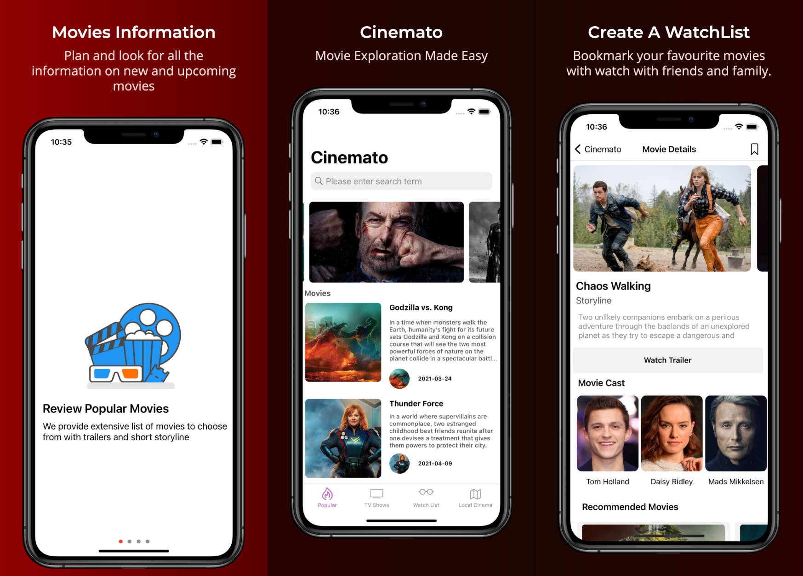

# Cinemato - Platform for Movie Enthusiasts

Cinemato project developed using swift programming language for Module 301CEM coursework. The application focuses on providing users to choose trending movies and tv shows and is using <a href="https://developers.themoviedb.org/"> TheMovieDB </a> api for fetching the details. The project was developed using the programmatic and UINib based visual approach to develop the complex layout.

## Screenshots

## What's Used while developing the application 
- MapKit Framework.
- UICollectionView with Flow and Compositional Layout.
- UITableViewController.
- CoreData.
- AVKit.
- URLSession.

## Libraries Used.
1. SDWebImage.
2. LBTATools.

## Credits:
- TheMovieDb provides the developer api to movies and tv shows detailed information.
- Lottie library developed by Airbnb.
  

